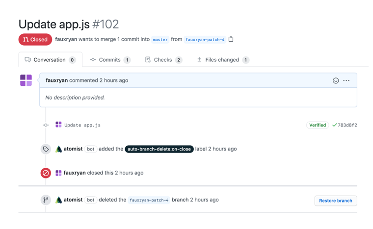

Never manually delete branches again. Is cleaning up branches after pull
requests are merged or closed a completely neglected task? This skill
automatically deletes branches for you once a pull request is merged or closed.
No more dangling branches cluttering up your repositories, and no need to
manually delete branches.

-   Automatic branch deletion when a pull request is merged or closed, no manual
    steps
-   Works across as many repositories as you want
-   Track pull request branch status in your chat channel of choice
-   Skip branch deletion when needed, simply remove the label from the pull
    request
-   Your choice of deletion policy — either only on merge or when either closed
    and merged

Additionally, this skill can list stale branches in chat and offer to clean up
those branches. This is triggered on a daily schedule and will post stale
branches to linked channels or manually via running
`@atomist list stale branches` from chat.

### Branches deleted, automatically, every time.

### Track pull request branch status in chat.

### Choose the deletion policy that works for you.

