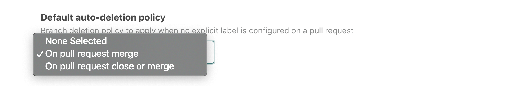

# `atomist/github-branch-deletion-skill`

<!---atomist-skill-description:start--->

Automatically delete pull request branches when a pull request is closed

<!---atomist-skill-description:end--->

---

<!---atomist-skill-long_description:start--->

Automatically delete pull request branches when a pull request is closed. 
No more dangling branches cluttering up your repositories, and no need to manually delete branches. 
Use this skill to automatically delete branches when pull requests are closed or closed merged.

<!---atomist-skill-long_description:end--->

---

<!---atomist-skill-readme:start--->
 
# What it's useful for

This skill automatically deletes pull request branches once a pull request is merged or closed so that you don't have to 
worry about old branches or periodically make time to clean them up.

Pull request authors or anyone with permissions in the repository can flag a pull request for branch auto-deletion. 

When a new pull request is created, this skill will automatically apply the default auto-deletion policy labels, if set. You can change the label directly on the pull request to change the auto-deletion policy for the pull request.

Simply remove the auto-deletion labels from a pull request if you do not want the branch to be auto-deleted.

Configure this skill to run on as many repositories as you want.

# Before you get started

Connect and configure these integrations:

1. **GitHub**
2. **Slack**

The **GitHub** integration must be configured in order to use this skill. At least one repository must be selected. 
We recommend connecting the **Slack** integration.

# How to configure

1. **Select the default auto-deletion policy**

    

    To do so when no explicit auto-deletion label is applied to the pull request, you can select one of the options:

    - **On pull request merge** — Deletes head branch when a pull request is merged.
    
    - **On pull request close or merge** — Deletes head branch when a pull request is closed regardless of its merge status.

2. **Determine repository scope**

    

    By default, this skill will be enabled for all repositories in all organizations you have connected.

    To restrict the organizations or specific repositories on which the skill will run, you can explicitly choose 
    organization(s) and repositories.

# How to use Pull Request Branch auto-deletion

1. **Configure skill, set default auto-deletion policy** 

2. **For every new pull request raised, this skill will automatically apply the following label when relevant:**

    **Auto-deletion policy labels**

    - `auto-branch-delete:on-merge`
    - `auto-branch-delete:on-close`

3. **Enjoy not having to manually clean up pull request branches when PRs are closed!**

Note: this skill automatically adds the labels needed for auto-deletion. 
    
To create feature requests or bug reports, create an [issue in the repository for this skill](https://github.com/atomist-skills/github-branch-deletion-skill/issues). 
See the [code](https://github.com/atomist-skills/github-branch-deletion-skill) for the skill.

<!---atomist-skill-readme:end--->

---

Created by [Atomist][atomist].
Need Help?  [Join our Slack workspace][slack].

[atomist]: https://atomist.com/ (Atomist - How Teams Deliver Software)
[slack]: https://join.atomist.com/ (Atomist Community Slack)
 
