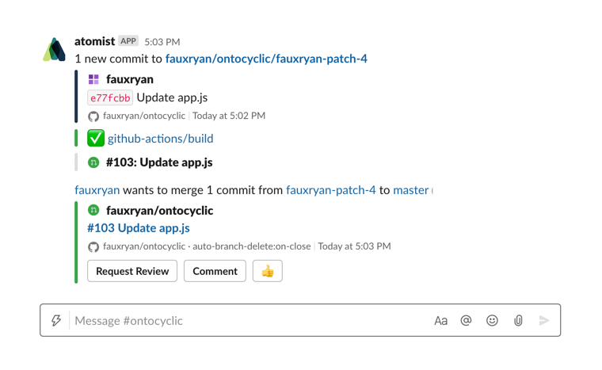

# `atomist/github-branch-deletion-skill`

<!---atomist-skill-description:start--->

Delete pull request branches when a pull request is closed

<!---atomist-skill-description:end--->

---

<!---atomist-skill-long_description:start--->

Automatically delete pull request branches when a pull request is closed.
No more dangling branches cluttering up your repositories, and no need to manually delete branches.
Use this skill to automatically delete branches when pull requests are closed or closed merged.

<!---atomist-skill-long_description:end--->

---

<!---atomist-skill-readme:start--->

Never manually delete branches again. Is cleaning up branches after pull requests are merged or closed a completely neglected task? This skill automatically deletes branches for you once a pull request is merged or closed.

-   Automatic branch deletion, no manual steps
-   Works across as many repositories as you want
-   Track pull request branch status in your chat channel of choice
-   Skip branch deletion when needed, simply remove the label from the pull request
-   Your choice of deletion policy — merge or close and merge

# Branches deleted, automatically, every time.

# Track pull request branch status in chat.

# Choose the deletion policy that works for you.

See the [code](https://github.com/atomist-skills/github-branch-deletion-skill) for the skill. To create feature requests or bug reports, create an [issue in the repository](https://github.com/atomist-skills/github-branch-deletion-skill/issues).

<!---atomist-skill-readme:end--->

---

Created by [Atomist][atomist].
Need Help? [Join our Slack workspace][slack].

[atomist]: https://atomist.com/ "Atomist - How Teams Deliver Software"
[slack]: https://join.atomist.com/ "Atomist Community Slack"
