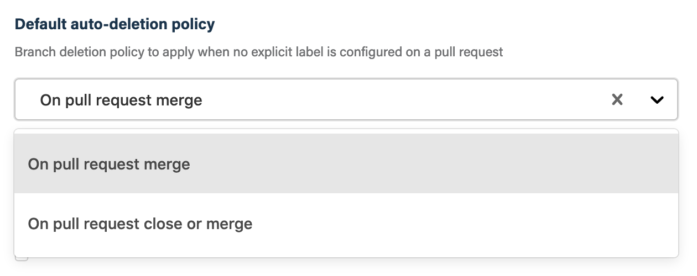
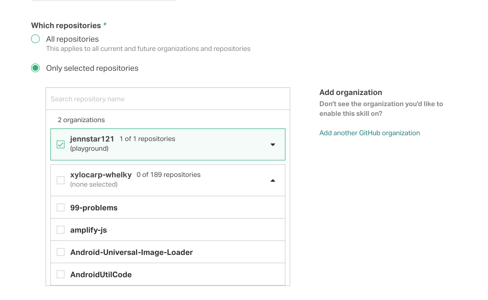

## Before you get started

Connect and configure these integrations:

1.  [**GitHub**](https://go.atomist.com/catalog/integration/github "GitHub Integration")
    _(required)_
1.  [**Slack**](https://go.atomist.com/catalog/integration/slack "Slack Integration")
    or
    [**Microsoft Teams**](https://go.atomist.com/catalog/integration/microsoft-teams "Microsoft Teams Integration")
    _(optional)_

## How to configure

1.  **Select the default deletion strategy**

    The selected deletion strategy will be used by default.

    

    You can select one of the options:

    -   **On pull request merge** — Only delete the branch when the pull request
        is merged. Do not delete the branch if the pull request is closed
        without merging.
    -   **On pull request close or merge** — Delete branch when pull request is
        either merged or closed without merging.

    The deletion policy for a specific pull request is managed by the
    auto-branch-delete:on-merge
    and
    auto-branch-delete:on-close
    labels. The default deletion policy determines the label that is
    automatically added to a pull request when it is created. You can change the
    policy for a specific pull request by manually changing its
    auto-branch-delete label to the desired behavior, or remove all
    auto-branch-delete labels to disable branch deletion for the pull request
    branch.

1.  **List stale branches**

    Select the check box to receive a daily chat message reminder of stale
    branches in your repositories.

1.  **Stale branch age**

    Enter the age in days that a branch must have no activity for it to be
    considered stale. The default value is seven (7).

1.  **Excluded branches**

    Enter branches that should never be considered stale. You may enter branch
    names or regular expressions matching branch names. By default, only the
    default branch is excluded.

1.  **Determine repository scope**

    

    By default, this skill will be enabled for all repositories in all
    organizations you have connected.

    To restrict the organizations or specific repositories on which the skill
    will run, you can explicitly choose organizations and repositories.

1.  **Activate the skill**

    Save your configuration and activate the skill by clicking the "Enable
    skill" button.
